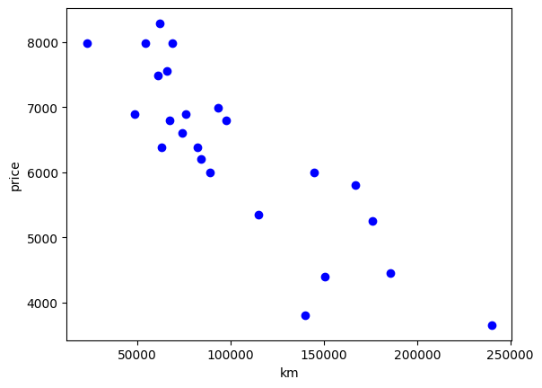
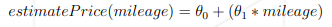
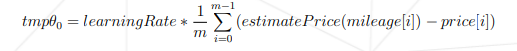
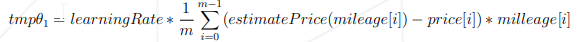
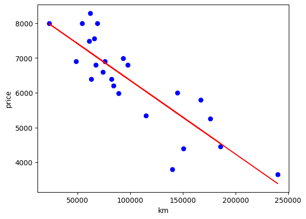

# ft_linear_regression

#### An introduction to machine learning
#### Data:

  
 Simple linear regression with a single feature - the mileage of the
car.\
The first program will use the following hypothesis to predict the price
:



The second program will be used to train model. It will read dataset
file and perform a linear regression on the data. Once the linear
regression has completed, i will save the variables theta0 and theta1
for use in the first program. Using the following formulas :\



## Result after train model
``` {.python}
predict(240000)
```
    Estimate price:  3390.205399572344


### Precision of algorithm:  73.28 %

